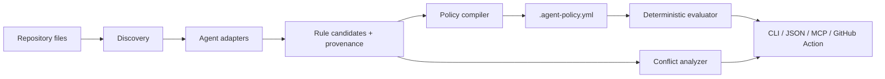

# GuardSpec architecture

> **GuardSpec compiles repository intent into enforceable agent boundaries.**

GuardSpec is a local-first TypeScript CLI and library. It discovers human-authored agent instructions already committed to a repository, represents every extracted rule with source provenance, merges them into a reviewable `.agent-policy.yml`, and evaluates proposed work deterministically. It is not a coding agent, a model wrapper, a cloud service, or a substitute for CI access control.

## Design objectives

| Objective                 | Design choice                                                                                                                                                                                                                |
| ------------------------- | ---------------------------------------------------------------------------------------------------------------------------------------------------------------------------------------------------------------------------- |
| Cross-agent compatibility | A stable core policy model with adapters for AGENTS.md, Codex overrides, Claude Code, GitHub Copilot, Cursor, OpenCode, Gemini, generic docs and repository controls.                                                        |
| Deterministic core        | Scanning, parsing, path matching, command checking, conflict detection, output ordering and exit codes require no network or model key.                                                                                      |
| Explainability            | Every rule has an ID, effect, scope, source file, source line, extraction confidence and deterministic decision trace.                                                                                                       |
| Least privilege           | The CLI reads repository files only. It never runs repository commands, invokes a model, calls the network, rewrites instruction files, or edits a repository unless the user explicitly runs `init` or `adapters generate`. |
| Reviewability             | `.agent-policy.yml` is human-readable YAML and machine-readable through a committed JSON Schema. Generated adapter files contain a provenance header.                                                                        |
| Portable integration      | The same policy engine backs CLI commands, a read-only stdio MCP server and a Node 20 GitHub Action.                                                                                                                         |

## Pipeline

## Source discovery and adapters

The discovery layer only walks inside the resolved Git root and ignores `.git`, `node_modules`, dependency/cache directories, generated coverage/build directories and symlink escapes. The adapter registry recognises current repository conventions documented by their providers: `AGENTS.md` and `AGENTS.override.md`; `CLAUDE.md` and `.claude/rules/**/*.md`; `.github/copilot-instructions.md` and `.github/instructions/**/*.instructions.md`; `.cursor/rules/**/*.mdc`; `GEMINI.md`; `opencode.json`; `.mcp.json`; `CODEOWNERS`; `SECURITY.md`; `CONTRIBUTING.md`; directory `README.md`; test/config manifests; and GitHub workflow paths.

Adapters never attempt to infer arbitrary natural-language policy as fact. They extract only explicit, high-confidence statements such as “must run `npm test`”, “do not modify `.github/workflows/**`”, “requires AI disclosure”, YAML frontmatter globs, CODEOWNERS protected paths, MCP server declarations, and commands from package/test configuration. Text that is visible but not reliably classifiable is recorded as a discovered source rather than converted to an enforcement rule.

## Policy model and merge semantics

A policy contains ordered `rules`. A rule includes `id`, `kind`, `effect`, `scope`, `value`, optional `severity`, and `provenance[]`. Rule kinds are `path`, `command`, `network`, `mcp`, `check`, `approval`, and `disclosure`. Effects are `allow`, `deny`, `require`, or `warn`.

For a proposed action, the evaluator considers rules matching its scope. More-specific path scopes outrank broader scopes. At an equal scope specificity, `deny` outranks `require`, `require` outranks `allow`, and `warn` is advisory. Rules at the same precedence that impose incompatible effects or values are a **conflict**, not silently resolved. A policy file may add explicit `overrides` that cite the overridden rule IDs; this leaves an auditable resolution trace.

## Security model

GuardSpec is a preflight compiler, not an execution sandbox. It does not run commands discovered from instruction files and never follows remote OpenCode instruction URLs. It treats repository contents as untrusted input, applies byte/file count limits, parses JSON/YAML defensively, rejects path traversal, preserves Windows drive/UNC rejection semantics, and excludes symlink escapes. Its MCP server exposes read-only query tools and writes protocol traffic only to stdout; logs go to stderr. The GitHub Action defaults to `contents: read` and analyzes only the checked-out workspace.

## Interfaces

| Interface           | Capabilities                                                   | Side effects                                            |
| ------------------- | -------------------------------------------------------------- | ------------------------------------------------------- |
| `guardspec scan`    | Discovery, compilation preview, conflict/risk report.          | Writes only if `--write` supplied.                      |
| `guardspec init`    | Creates a commented policy from existing discovered rules.     | Writes `.agent-policy.yml` only after explicit command. |
| `guardspec check`   | Evaluates a task manifest or CLI-supplied paths/commands.      | None.                                                   |
| `guardspec explain` | Shows decision trace and provenance for a rule or decision.    | None.                                                   |
| `guardspec mcp`     | Starts read-only stdio MCP query server.                       | None except process output.                             |
| GitHub Action       | Validates policy and reports conflicts/protected-file changes. | Emits annotations/SARIF/JSON; no repository write.      |

## Non-goals in v0.1.0

GuardSpec does not promise to understand every sentence in every rule file, manage agent credentials, enforce external SaaS agent behavior, automatically mutate CI, execute commands, call a model, replace branch protection, or claim that generated policies confer OS-level sandboxing. These boundaries are intentional and documented in the README and threat model.
