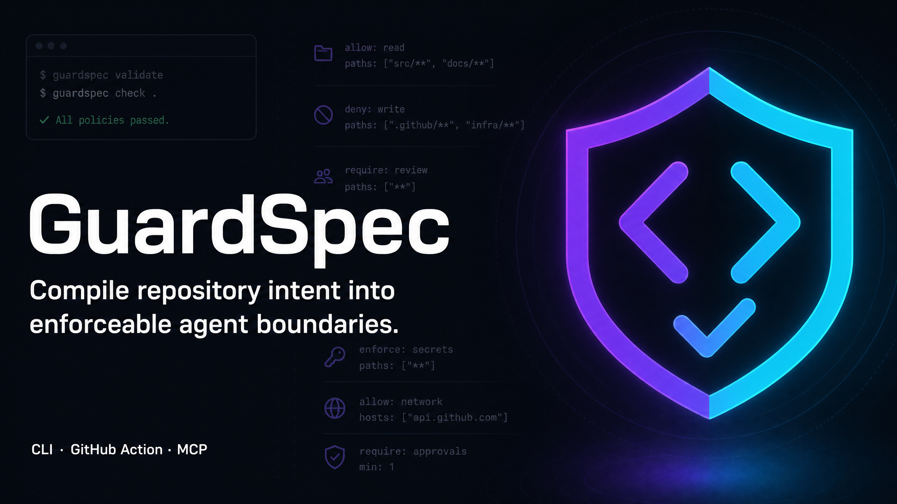

<p align="center">
  
</p>

<h1 align="center">GuardSpec</h1>

<p align="center"><strong>Compile repository intent into enforceable agent boundaries.</strong></p>

<p align="center">
  
</p>

<p align="center">
  <a href="https://github.com/pangxueyuan2-creator/guardspec/actions"></a>
  <a href="https://github.com/pangxueyuan2-creator/guardspec/releases"></a>
  <a href="LICENSE"></a>
  
</p>

Coding agents are good at acting on repository instructions; teams still need a deterministic way to **see which instructions exist, reconcile conflicts, and preflight a proposed change before an agent runs**. GuardSpec discovers rule sources such as `AGENTS.md`, `CLAUDE.md`, Copilot instructions, Cursor rules, `CODEOWNERS`, `SECURITY.md`, and common Agent configuration; compiles explicit rules into a reviewed `.agent-policy.yml`; then answers whether a path, command, network request, or MCP server is permitted.

> GuardSpec is a **local policy compiler and preflight tool**. It does not execute repository commands, contact a model, change agent permissions, or turn natural-language files into an OS sandbox. It makes explicit rules inspectable and machine-checkable before work begins.

## Why this exists

`AGENTS.md` has become a portable format for repository guidance, while Codex, Cursor, OpenCode and Copilot each support their own layered or path-scoped instruction mechanisms.[1][2][3][4] Those files are valuable context, but they are usually prompt-level guidance, not a consistent pre-execution decision surface across agent runtimes. The market is dense with coding agents, agent fleets, MCP servers, memory systems and skill packs; GuardSpec focuses on the narrower gap between repository intent and **deterministic, explainable checks**.

| GuardSpec does                                                               | GuardSpec deliberately does not                                                        |
| ---------------------------------------------------------------------------- | -------------------------------------------------------------------------------------- |
| Discovers instruction sources and explicit rules with line-level provenance. | Pretend it can reliably enforce every sentence in free-form prose.                     |
| Detects equal-scope `allow`/`deny` conflicts instead of choosing silently.   | Run a coding agent, model, shell command, test command, or remote prompt.              |
| Evaluates proposed paths, commands, network domains and MCP server names.    | Replace branch protection, code review, sandboxing, or CI permissions.                 |
| Serves the same policy through CLI, read-only stdio MCP and GitHub Action.   | Telemetry, cloud synchronization, credential management, or automatic policy mutation. |

## Quick start

GuardSpec is an npm package and Node 20+ CLI. Until you choose to publish it to the npm registry, install from a checked-out release or the GitHub release tarball:

```bash
git clone https://github.com/pangxueyuan2-creator/guardspec.git
cd guardspec
corepack enable
pnpm install --frozen-lockfile
pnpm build
pnpm link --global

# Inspect existing repository rules without changing files.
guardspec scan --root /path/to/repository

# Create a reviewable policy; this is an explicit write.
guardspec init --root /path/to/repository

# Ask before an agent makes a change. Exit 0=allowed, 2=denied, 3=conflict.
guardspec check --root /path/to/repository \
  --path src/auth/session.ts \
  --command "pnpm test" \
  --ai-assisted
```

The emitted policy is a small, human-reviewed YAML document. Every generated rule preserves its source and line number.

```yaml
version: 1
name: my-repository
rules:
  - id: agents-md-path-agents-md-3
    kind: path
    effect: deny
    scope: .github/workflows/**
    severity: high
    message: Instruction forbids changes to this path.
    provenance:
      - source: AGENTS.md
        line: 3
        adapter: agents-md
        excerpt: path:deny:.github/workflows/**
        confidence: high
```

## Where GuardSpec fits

Use GuardSpec **before** an agent begins work when a repository has policy spread across `AGENTS.md`, `CLAUDE.md`, Copilot instructions, Cursor rules, `CODEOWNERS`, and similar files. It makes explicit path, command, network, MCP, disclosure, and check requirements queryable without executing any repository code.

For a complementary **post-change** evidence gate, evaluate the real patch and the checks it ran with [PatchWitness](https://github.com/pangxueyuan2-creator/patchwitness). GuardSpec does not verify that a change stayed in scope after it was made; PatchWitness does not compile an estate of repository instructions into a preflight policy. Use either tool independently when its narrower boundary fits the workflow. See the [optional handoff guide](docs/integrations/patchwitness.md) for a boundary-preserving sequence.

## Real demo

The committed demo copies a small Git repository to a temporary worktree, compiles its actual `AGENTS.md`, permits the intended authentication fix, blocks CI and policy self-modification, runs a real Node test, and prints the actual `git diff`. It does not replay fabricated terminal output. In the release-validation run, it completed with two allowed preflight decisions, two denied protected-path decisions, and two passing Node tests.

```bash
pnpm build
bash demo/run-demo.sh
```

Expected milestones are an `ALLOWED path src/auth/session.js` decision, two `DENIED` decisions for `.github/workflows/ci.yml` and `.agent-policy.yml`, passing `node --test` output, and a diff that changes `return token` to `return token || null`.

## CLI reference

| Command                                                                  | Purpose                                                                 | Side effects                     |
| ------------------------------------------------------------------------ | ----------------------------------------------------------------------- | -------------------------------- |
| `guardspec scan [--root PATH] [--json] [--write]`                        | Discovers sources, extracts explicit rules, reports conflicts and risk. | Read-only unless `--write`.      |
| `guardspec init [--root PATH] [--force]`                                 | Writes a reviewed policy plus three conservative baseline protections.  | Writes `.agent-policy.yml`.      |
| `guardspec check --path … --command … --network … --mcp … --ai-assisted` | Evaluates a proposed task and returns a stable exit code/JSON.          | None.                            |
| `guardspec explain RULE_ID_OR_PATH`                                      | Shows a source rule or the path decision trace.                         | None.                            |
| `guardspec policy validate`                                              | Parses and validates a policy against the v1 contract.                  | None.                            |
| `guardspec adapters generate {agents                                     | claude                                                                  | copilot                          | cursor | gemini | opencode}` | Generates a marked, derived instruction copy from the reviewed policy. | Writes the requested adapter file. |
| `guardspec doctor`                                                       | Shows runtime, policy-presence and privacy facts.                       | None.                            |
| `guardspec mcp`                                                          | Starts the read-only stdio MCP server.                                  | Long-running local process only. |

Use `--json` for stable machine-readable output. GuardSpec does not issue an `allow` for an unresolved equal-scope conflict; it returns exit code `3` instead.

## Agent compatibility

The v0.1 adapters discover and/or generate the following local, version-controlled formats. “Support” means deterministic discovery, provenance and limited explicit-rule compilation, not that GuardSpec claims to replace that product’s runtime behavior.

| Surface               | Discovered source                                                              | Generated derived file            | Notes                                                                                               |
| --------------------- | ------------------------------------------------------------------------------ | --------------------------------- | --------------------------------------------------------------------------------------------------- |
| Open standard / Codex | `AGENTS.md`, `AGENTS.override.md`                                              | `AGENTS.md`                       | Codex layers per-directory guidance and documents root-to-working-directory precedence.[1]          |
| Claude Code           | `CLAUDE.md`, `.claude/rules/**/*.md`                                           | `CLAUDE.md`                       | Claude documents memory/rules as context; it recommends hooks for action prevention.[5]             |
| GitHub Copilot        | `.github/copilot-instructions.md`, `.github/instructions/**/*.instructions.md` | `.github/copilot-instructions.md` | Copilot supports repository, path-scoped, and `AGENTS.md` instructions.[3]                          |
| Cursor                | `.cursor/rules/**/*.mdc`, `.cursorrules`                                       | `.cursor/rules/guardspec.mdc`     | Cursor rules may use globs and `alwaysApply` frontmatter.[4]                                        |
| Gemini CLI            | `GEMINI.md`, `.gemini/**`                                                      | `GEMINI.md`                       | Discovery is local and conservative.                                                                |
| OpenCode              | `opencode.json`, `AGENTS.md`                                                   | `AGENTS.md`                       | OpenCode documents `AGENTS.md`, `CLAUDE.md` fallback and `opencode.json` instruction references.[2] |
| MCP                   | `.mcp.json`                                                                    | —                                 | GuardSpec never connects to or trusts discovered MCP servers.                                       |

### Read-only MCP server

GuardSpec’s MCP server offers six local tools: `get_repository_policy`, `can_modify_path`, `can_run_command`, `required_checks`, `explain_rule`, and `preflight_task`. It uses stdio, produces protocol output only on stdout, and has no write or shell-execution tool.

```json
{
  "mcpServers": {
    "guardspec": {
      "command": "guardspec",
      "args": ["mcp", "--root", "/absolute/path/to/repository"]
    }
  }
}
```

## GitHub Action

Use the committed action in a repository after reviewing its policy. The action validates policy, evaluates supplied or Git-derived changed files, emits annotations/SARIF, and defaults to read-only repository access.

```yaml
name: Agent policy preflight
on: [pull_request]
permissions:
  contents: read
jobs:
  guardspec:
    runs-on: ubuntu-latest
    steps:
      - uses: actions/checkout@v5
      - uses: pangxueyuan2-creator/guardspec/action@v0.1.0
        with:
          policy: .agent-policy.yml
          ai-assisted: ${{ contains(github.event.pull_request.body, 'AI-assisted') }}
```

## Safety and privacy

GuardSpec never uses a model provider or remote API. Its deterministic core does not execute commands discovered from repository content, does not fetch remote OpenCode instructions, ignores symlink escapes, rejects traversal/absolute/Windows-drive paths, limits file traversal and file size, and keeps telemetry disabled. The Action uses the checked-out workspace and should be paired with GitHub’s least-privilege `permissions` settings. See [ARCHITECTURE.md](ARCHITECTURE.md) and [docs/security-model.md](docs/security-model.md) for the threat model.

## Development

```bash
pnpm install --frozen-lockfile
pnpm format:check
pnpm lint
pnpm typecheck
pnpm test
pnpm action:build
pnpm pack:check
```

The test suite includes core policy tests, Python/Copilot/CODEOWNERS and Cursor/monorepo fixtures, adversarial path/symlink coverage, CLI JSON/init/adapter cases, and the committed real demo. Contributions are welcome through [CONTRIBUTING.md](CONTRIBUTING.md). Please report security issues privately under [SECURITY.md](SECURITY.md).

## License

Released under the [MIT License](LICENSE).

## References

[1]: https://learn.chatgpt.com/docs/agent-configuration/agents-md "OpenAI Codex: Custom instructions with AGENTS.md"
[2]: https://opencode.ai/docs/rules/ "OpenCode Rules"
[3]: https://docs.github.com/copilot/customizing-copilot/adding-custom-instructions-for-github-copilot "GitHub Copilot custom instructions"
[4]: https://cursor.com/docs/rules "Cursor Rules"
[5]: https://docs.anthropic.com/en/docs/claude-code/memory "Claude Code memory and rules"
